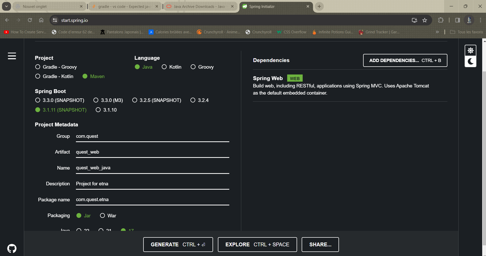
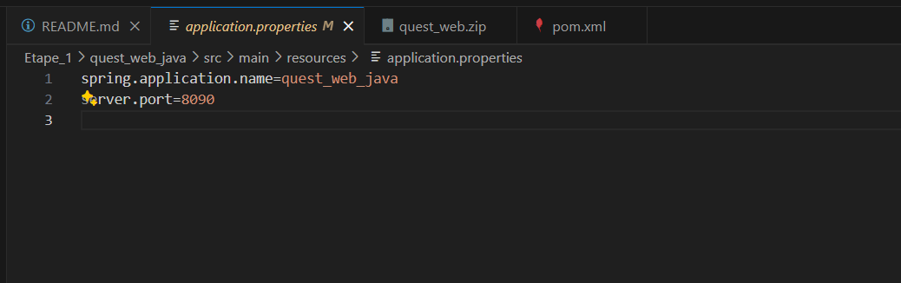
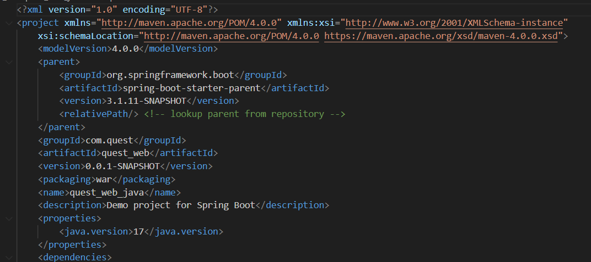

## Prérequis

Avant de commencer, il faut avoir installé les éléments suivants :

- [MySQL 8.0.36](https://dev.mysql.com/downloads/installer/)
- [Java 17](https://www.oracle.com/java/technologies/javase/jdk17-archive-downloads.html)
- [Spring Tools](https://spring.io/tools)

## Etape 1: Initialisation du Projet avec Spring Boot

### Création du Projet

1. Ouvre Spring Tool Suite.
2. Crée un nouveau projet Maven en utilisant Spring Starter Project via https://start.spring.io/.  

3. Remplisse les paramètres comme suit :
   - Name: quest_web_java
   - Group: com.quest
   - Artifact: quest_web
   - Package: com.quest.etna
   - Version: 0.0.1-SNAPSHOT
   - Java Version: 20 (ou 17)
   - Spring Boot Version: 3.0.* ou 3.1.* (version stable uniquement)
   - Modules: Spring Web

### Démarrage du Projet

1. Une fois le projet créé, il faut assurer que la classe `QuestWebJavaApplication` est générée.
2. Démarrage l'application et nous devons voir un message "Whitelabel Error Page" en accédant à http://localhost:8080/.

### Changement de Port

Modification du port de l'application de 8080 à 8090 en modifiant les propriétés dans le fichier `application.properties`.
  

et lors de l'initialisation du springboot : 
  

### Ajout d'un Contrôleur

1. Création un package `controller` dans `com.quest.etna`.
2. Création une classe nommée `DefaultController` dans ce package.
3. Ajoute les méthodes suivantes à cette classe :

```java
package com.quest.etna.controller;

import org.springframework.http.HttpStatus;
import org.springframework.http.ResponseEntity;
import org.springframework.web.bind.annotation.GetMapping;
import org.springframework.web.bind.annotation.RestController;

@RestController
public class DefaultController {

    @GetMapping("/testSuccess")
    public ResponseEntity<String> testSuccess() {
        return new ResponseEntity<>("success", HttpStatus.OK);
    }

    @GetMapping("/testNotFound")
    public ResponseEntity<String> testNotFound() {
        return new ResponseEntity<>("not found", HttpStatus.NOT_FOUND);
    }

    @GetMapping("/testError")
    public ResponseEntity<String> testError() {
        return new ResponseEntity<>("error", HttpStatus.INTERNAL_SERVER_ERROR);
    }
}
```

### Test de l'Application

Pour verifier que tout est bon nous assurons les appels à l'application retournent le contenu et les codes HTTP appropriés.
