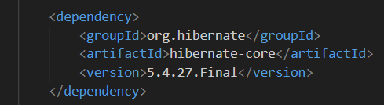

## Etape 2: Mise en place d'une Entité dans un Projet Spring Boot

### Setup de la base de donnée Sql 

1. Lancement du script.sql après avoir installer mysql server + shell :  
```cd Etape_2```  

windows: ```Get-Content script.sql | mysqlsh.exe -u root -p```  
Mac/linux : ```mysql -u root -p < script.sql```

puis, copie projet de Etape_1 dans un dossier nommé Etape_2.

2. Ajout de la dépendance MySQL dans le fichier `pom.xml` :

```xml
<dependency>
  <groupId>org.springframework.boot</groupId>
  <artifactId>spring-boot-starter-data-jpa</artifactId>
</dependency>

<dependency>
  <groupId>com.mysql</groupId>
  <artifactId>mysql-connector-java</artifactId>
  <scope>runtime</scope>
</dependency>
```

Import des librairies hibernate, pour utilisation des annotations hibernate.  
  

3. Configuration du datasource dans `application.properties` :

```properties
spring.datasource.url=jdbc:mysql://localhost:3306/quest_web?useUnicode=true&characterEncoding=utf8&useSSL=false&serverTimezone=UTC
spring.datasource.username=application
spring.datasource.password=password
spring.datasource.driver-class-name=com.mysql.cj.jdbc.Driver
spring.jpa.properties.hibernate.dialect=org.hibernate.dialect.MySQL8Dialect
spring.jpa.show-sql=true
```

### Création de l'Entité User et du Modèle UserDetails

Création de la table user en respectant les consignes en utilisant Java Code generator : 

1. Création un package `model` dans `com.quest.etna`.
2. Création une classe nommée `User` dans ce package.
3. Créaion un nouveau modèle `UserDetails` avec les propriétés id, username et role.


### Transformation de la Réponse en Format JSON dans le Contrôleur

Dans le contrôleur `AuthenticationController`, la réponse est transformée en format JSON comme suit :

```java
@PostMapping("/register")
public ResponseEntity<?> register(@RequestBody User user) {
    if (userRepository.findByUsername(user.getUsername()) != null) {
        Map<String, String> response = new HashMap<>();
        response.put("message", "Cet utilisateur existe déjà");
        return new ResponseEntity<>(response, HttpStatus.CONFLICT);
    }

    try {
        User savedUser = userRepository.save(user);
        UserDetails userDetails = new UserDetails();
        userDetails.setId(savedUser.getId());
        userDetails.setUsername(savedUser.getUsername());
        userDetails.setRole(savedUser.getRole());
        return new ResponseEntity<>(userDetails, HttpStatus.CREATED);
    } catch (Exception e) {
        Map<String, String> response = new HashMap<>();
        response.put("message", "Un champ n'est pas rempli ou mal rempli.");
        return new ResponseEntity<>(response, HttpStatus.INTERNAL_SERVER_ERROR);
    }
}
```

Dans ce code, un objet `HashMap` est utilisé pour créer une réponse JSON contenant un message spécifique en cas de conflit ou d'erreur. Ce message est ensuite envoyé avec le code de statut HTTP approprié à l'aide de la classe `ResponseEntity`.


