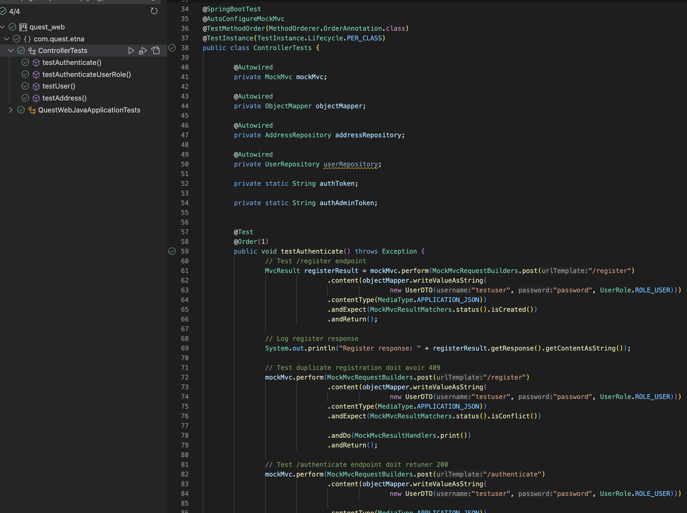
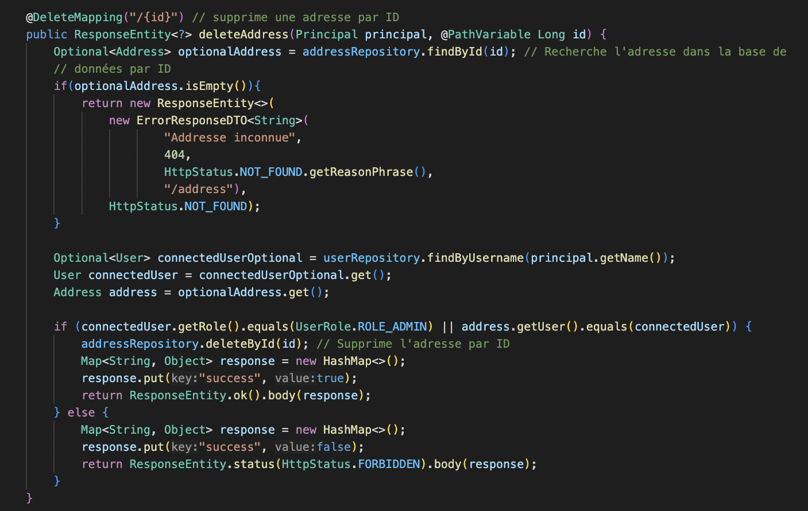
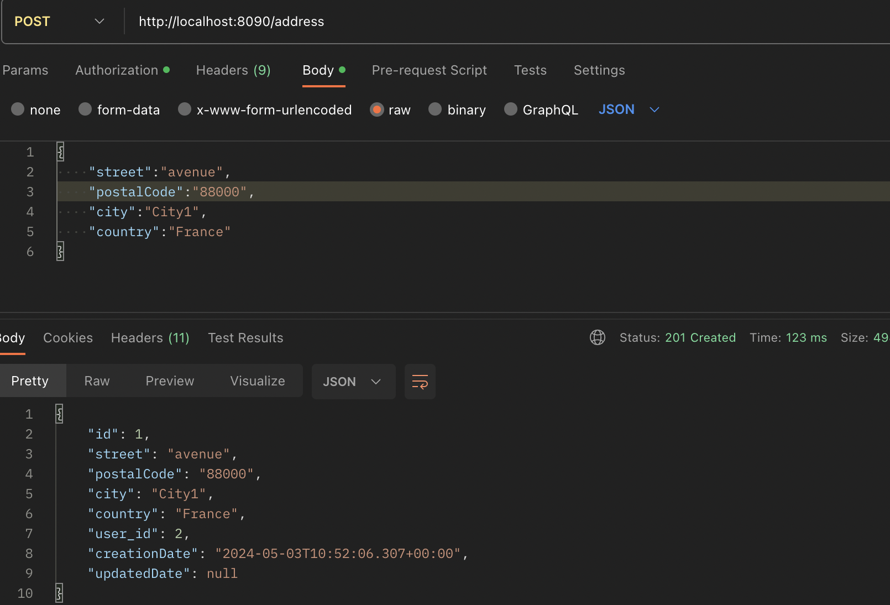
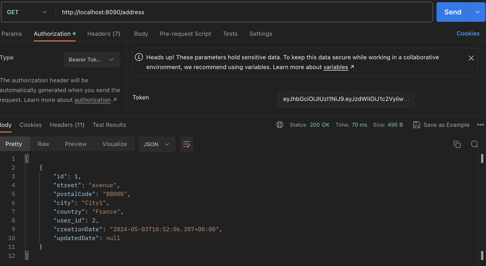
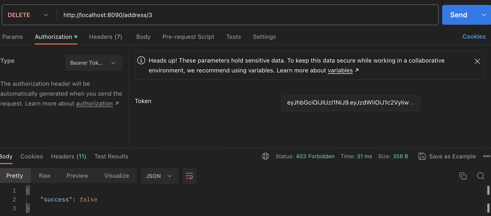
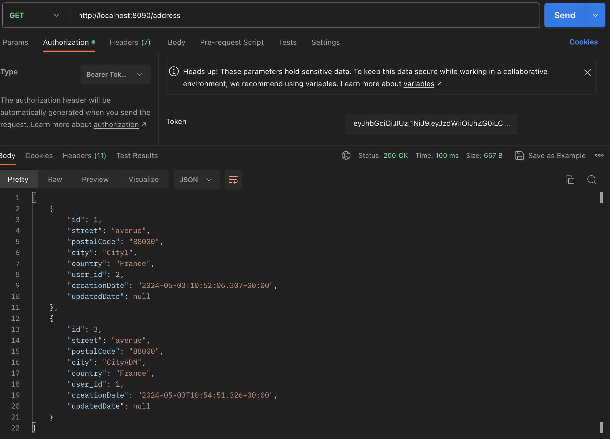
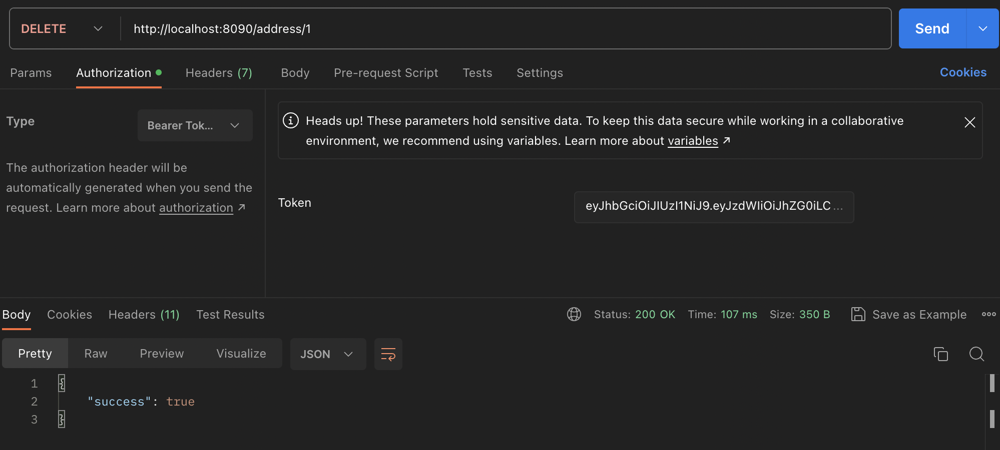

# Étape 4 : Ajouter de nouvelles entités dans SpringBoot et implémenter des tests unitaires

Dans cette étape, nous avons ajouté la nouvelles entities `Address` et mettons en place l'autorisation basée sur les rôles pour contrôler l'accès aux fonctionnalités de l'application. Les utilisateurs auront des rôles attribués, tels que ROLE_USER et ROLE_ADMIN, et l'accès aux ressources sera restreint en fonction de ces rôles.

## Ajout d'une entité Address

1. **Ajout d'une entité Address** :

  Nous avons tout d'abord ajouter une nouvelle entité Address avec les paramètres suivants :
   - `id` : auto-généré et unique
   - `street` : chaîne de caractères (non vide, maximum 100 caractères)
   - `postalCode` : chaîne de caractères (non vide, maximum 30 caractères)
   - `city` : chaîne de caractères (non vide, maximum 50 caractères)
   - `country` : chaîne de caractères (non vide, maximum 50 caractères) 
   - `user` : relation Many-To-One
   - `creationDate` : date
   - `updatedDate` : date

2. **Création de son contrôleur REST** :

  Ensuite creation un contrôleur REST nommé `AddressController` préfixé en `/address` qui contiendra les méthodes suivantes :
 - `GET` : pour récupérer une liste ou une seule adresse
 - `POST` : création d'une nouvelle adresse
 - `PUT` : Modification d'un adresse
 - `DELETE` : Suppression d'une adresse

3. **Ajout d'un contrôleur REST pour les utilisateurs** :

  Pour terminer, nous avons crée un contrôleur REST nommé `UserController` préfixé en `/user`, qui contiendra les méthodes suivantes :

4. **Tests unitaires** :

  Nous avons crée une classe de tests unitaires appelée ControllerTests en utilisant MockMvc. Voici les tests que nous avons implémenté et ses resultats :
  - `GET` : Pour récupérer la liste des utilisateurs, ou d'un utilisateur précis.
  - `PUT` : Pour modifier le rôle et le username de l'utilisateur.
  - `DELETE` : Pour supprimer un utilisateur.

## Tests unitaires

Une fois que les nouvelles entités, leurs requets et logique ont été implementé, nous avons crée une classe de tests unitaires appelée `ControllerTests` qui utilise MockMvc. nous avons implmenté tous les Test Unitaires demandé par le sujet en vérifiant les cas suivant :

Nous avons choisi d'utiliser les annotations suivantes pour nos tests unitaires :

- `@SpringBootTest` : pour charger l'application Spring Boot lors de l'exécution des tests, permettant ainsi d'avoir un contexte d'application complet.
- `@AutoConfigureMockMvc` : pour configurer automatiquement MockMvc, facilitant ainsi l'intégration des tests avec les contrôleurs REST.
- `@TestMethodOrder(MethodOrderer.OrderAnnotation.class)` : pour ordonner l'exécution des tests en fonction des annotations d'ordre, ce qui peut être utile pour contrôler la séquence d'exécution des tests.
- `@TestInstance(TestInstance.Lifecycle.PER_CLASS)` : pour spécifier que les instances de tests doivent être créées une seule fois par classe de test, ce qui peut améliorer les performances en évitant la recréation d'instances à chaque méthode de test.

### Fonction testAuthenticate**

- Vérification que la route /register répond bien en 201.
- Vérification que rappeler /register avec les mêmes paramètres donne une réponse 409 car l'utilisateur existe déjà.
- Vérification que la route /authenticate retourne bien un statut 200 ainsi que votre token.
- Vérification que la route /me retourne un statut 200 avec les informations de l'utilisateur (avec le token Bearer).

### Fonction testUser
- Vérification que sans token Bearer, la route `/user` retourne bien un statut 401.
- Vérification qu'avec un token Bearer valide, la route `/user` retourne bien un statut 200.
- Vérification qu'avec un ROLE_USER, la suppression retourne bien un statut 403.
- Vérification qu'avec un ROLE_ADMIN, la suppression retourne bien un statut 200.

### Fonction testAddress
- Vérification que sans token Bearer, la route `/address/` retourne bien un statut 401.
- Vérification qu'avec un token Bearer valide, la route `/address/` retourne bien un statut 200.
- Vérification qu'avec un token Bearer valide, l'ajout d'une adresse retourne bien un statut 201.
- Vérification qu'avec un ROLE_USER, la suppression d'une adresse qui n'est pas la sienne retourne bien un statut 403.
- Vérification qu'avec un ROLE_ADMIN, la suppression d'une adresse qui n'est pas la sienne retourne bien un statut 200.

## Example accès aux fonctionnalités :

- **Endpoint de suppression d'adresse** :
  - `DELETE /address/{id}` : Endpoint pour supprimer une adresse. Seuls les utilisateurs ayant le rôle ROLE_ADMIN ou l'utilisateur propriétaire de l'adresse peuvent accéder à cette fonctionnalité.

  

## Exécution du projet

Pour tester le projet, nous assurrons que l'application Spring Boot est en cours d'exécution et Nous utilisons Postman pour tester les points de terminaison en suivant ces étapes :

### Test des enpoinst sur POSTMAN :

Dans ce test nous avons crée une address pour une USER et USER_ADMIN pour tester les differents cas.

**_Test avec un utilisateur ayant le rôle ROLE_USER :_**

-  Envoie une demande POST à l'endpoint `/address` avec le token JWT dans le header d'Authorization. L'utilisateur recois la reponse 201 et les data sur l'adresse crée :

- Envoie une demande GET à l'endpoint `/address/{id}` avec le token JWT dans le header d'Authorization. L'utilisateur avoir just l'access aux adresses qui lui appartient avec une reposne 200  :

- Envoie une demande DELETE à l'endpoint `/address/{id}` avec le token JWT dans le header d'Authorization. L'utilisateur n'est pas le propriétaire de l'adresse et nous avons fait une verificatoin que la réponse est une erreur 403 (Forbidden) :

**_Test avec un utilisateur ayant le rôle ROLE_ADMIN :_**

- Envoie une demande GET à l'endpoint `/address/{id}` avec le token JWT dans le header d'Authorization de ADMIN. L'admin a l'access aux adresses de tous les utilisateurs y compris celui qui l'appartient avec une reposne 200  :

- Envoie une demande DELETE à l'endpoint `/address/{id}` de celui qui l'appartient pas. L'admin recoit la réponse est un succès (200) :

